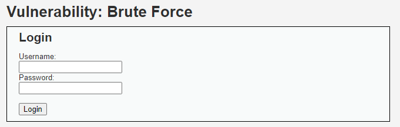
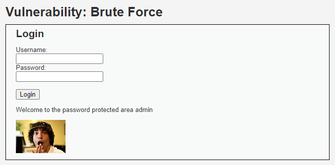

# VULNERABILITY: BRUTE FORCE

## Security level: Low

At this stage of brute force attacks, it's actually not necessary to use any intruder tool. We can easily type in any keyword that related such as `admin` or `administrator` on the username field, the password should be something simple like `admin123`, `123@123` or `password`. Let's try some pairs of these before deciding if we should use a brute force tool. 

Voila! So the username is `admin` and the password is `password`.

## Security level: Medium

